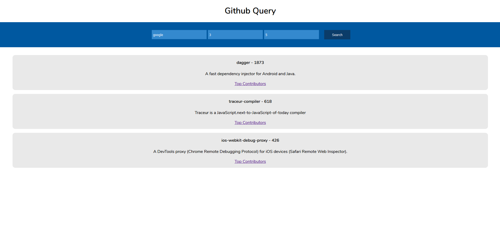
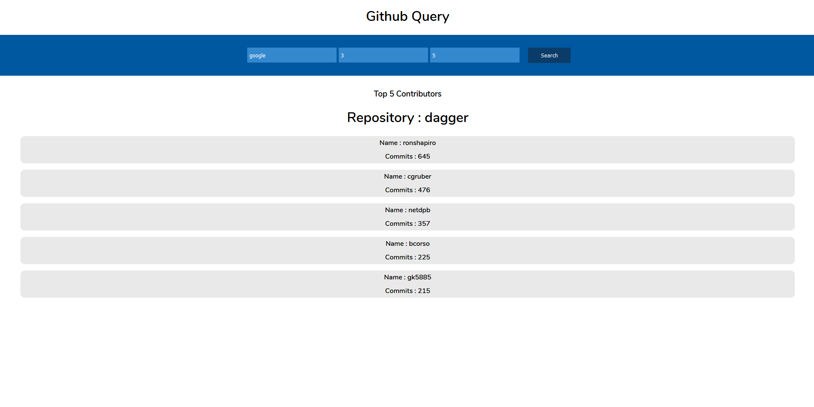

# Getting Started

To setup locally ,fork this project or download zip. Then first run `npm install` to install all the packages.\
Then run `npm start`\
The page will reload if you make edits.\
You will also see any lint errors in the console.
### Live link: https://github-query.herokuapp.com

## How it works
This app fetches repositories from the github api according to the name of the organization that shall\
be given as input. You can also enter the number of repositories to display. For every repository you can view\
the `Top Contributors` by clicking the link and the number of contributors is also accepted as an input.

### To see the top contributors click on the link

## Rate Limit 
The github api has a rate limit of 60 requests per hour so if you get an error even after giving valid inputs please wait for some time and try again.

